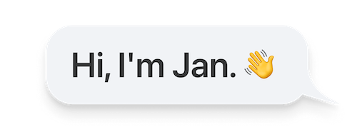

	

Welcome to my profile! I'm a computer science student at TU Chemnitz with a passion for automation, serverless architectures and iOS apps.

- 🔭 I’m currently working on something cool 😉
- 🌱 I’m currently learning SwiftUI and a bit of ML.
- 📫 How to reach me: [@Alpaone](https://twitter.com/Alpaone)
- 👨‍💻  Read more about my projects at [janhuelsmann.com](https://janhuelsmann.com)
- ⚡ Fun fact: I ❤️ mechanical keyboards

<!--
**thealpa/thealpa** is a ✨ _special_ ✨ repository because its `README.md` (this file) appears on your GitHub profile.

Here are some ideas to get you started:

- 🔭 I’m currently working on ...
- 🌱 I’m currently learning ...
- 👯 I’m looking to collaborate on ...
- 🤔 I’m looking for help with ...
- 💬 Ask me about ...
- 📫 How to reach me: ...
- 😄 Pronouns: ...
- ⚡ Fun fact: ...
-->
